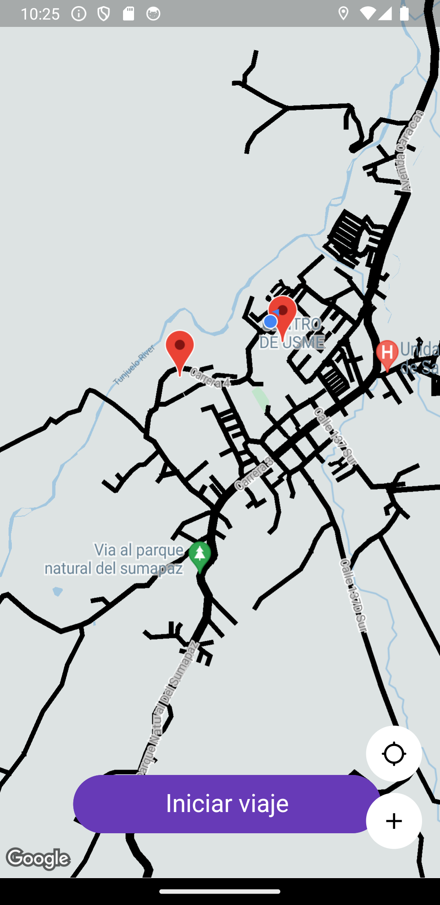

# prueba_digitalsolution_flutter

Este proyecto está desarrollador en Flutter con el lenguaje de programación Dart.

## Requisitos

- Instalar y configurar Flutter en el computador. [Link Flutter](https://flutter.dev/docs/get-started/install)
- Instalar y configurar Android Studio. [Link Android Studio](https://developer.android.com/studio)

> Versión de Flutter 2.10.1

## Versión Móvil.

Se deja un APK para la prueba desde dispositivos Android dentro de la carpeta APK, se pide los permisos de la localización para poder saber la ubicación y setear la ubicación en el mapa. Ya hay unos datos como clientes o productos definidos que se podrán consultar en los `Markers` que aparecen al iniciar el mapa, como se muestra en la siguiente imagen.

## Versión Web.

No hay plugin para obtener la ubicación del dispositivo en Web, por este motivo no se puede ejecutar en Web, en este caso se está usando el plugin `Geolocator` que tiene soporte para `Web` pero no se puede ejecutar en protocolo HTTP, sólo funciona en protocolo HTTPS, como lo indica su documentación oficial [Geolocator Documentación](https://pub.dev/packages/geolocator), de igual manera se adjunta imagen de la razón.

